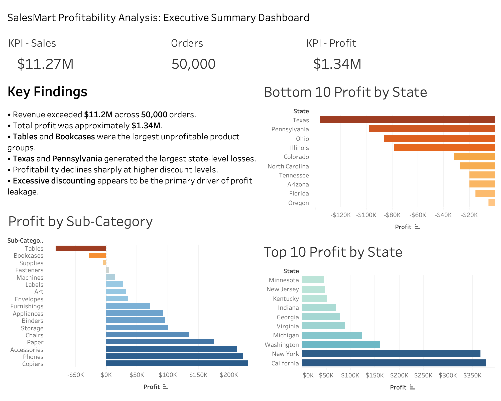
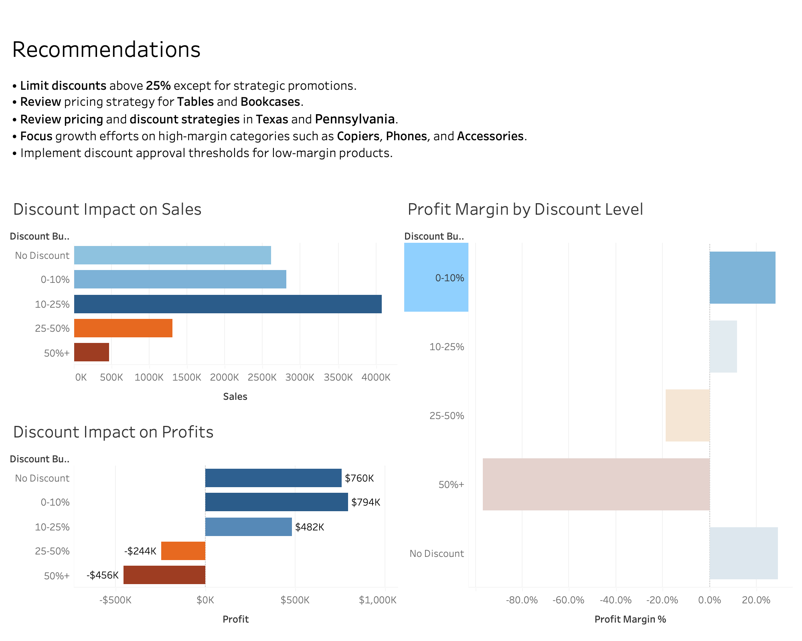
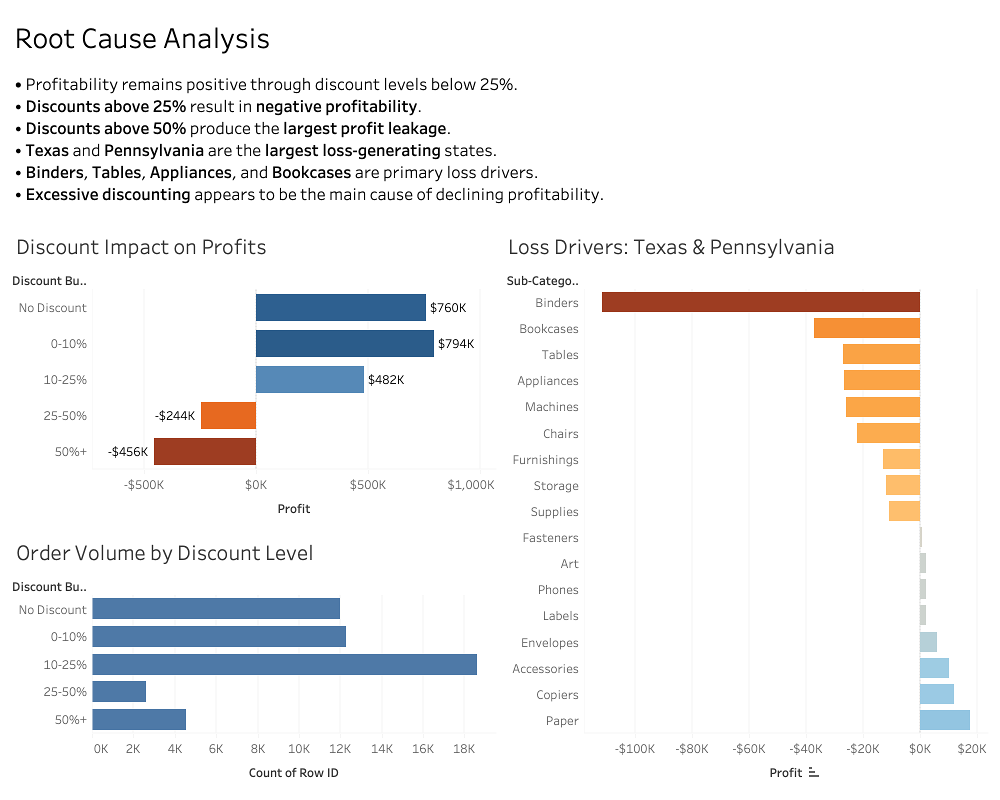

# Retail Profitability Analysis

## Project Overview

This project analyzes a retail sales dataset containing 50,000 transactions to identify drivers of profitability, regional performance differences, and the impact of discounting on profit margins.

The analysis was conducted using PostgreSQL and SQL, with Tableau used to visualize findings and communicate business insights.

---

## Business Problem

Although Sales Mart generated over $11 million in revenue and $1.34 million in profit, profitability varied significantly across regions, states, discount levels, and product categories.

The objective was to identify:

- Which regions underperformed
- Which products generated losses
- Whether discounting affected profitability
- Opportunities to improve profit margins

---

## Tools Used

- PostgreSQL
- SQL
- Git/GitHub
- Tableau

---

## Dataset Summary

| Metric | Value |
|----------|----------:|
| Orders | 50,000 |
| Sales | $11.27M |
| Profit | $1.34M |
| Profit Margin | 11.85% |
| Average Discount | 16% |

---

## Key Findings

### 1. High Discounts Reduced Profitability

Discounting emerged as the primary driver of profit leakage. While discounts below 25% remained profitable, discounts above 25% generated significant losses, and orders discounted over 50% produced the lowest profit margins in the dataset.

### 2. State-Level Losses Were Concentrated in a Small Number of States

The Central region generated the largest overall losses. At the state level, Texas produced the highest losses, followed by Pennsylvania, indicating that profitability challenges were concentrated within a small number of geographic markets.

### 3. Several Product Categories Operated at Negative Margins

The largest loss-generating categories included:

- Tables
- Bookcases
- Supplies

These categories generated strong sales volume but consistently underperformed on profitability.

### 4. Profitability Declined as Discounts Increased

Products that were profitable at low discount levels frequently became unprofitable once discounts exceeded approximately 25%.

---

## Recommendations

1. Limit discounts above 25%.
2. Review pricing and discount strategies in Texas and Pennsylvania, while conducting further investigation into other underperforming Central region states.
3. Reevaluate pricing for Tables, Bookcases, and other low-margin products.
4. Implement product-specific discount thresholds.

---
## Dashboard Screenshots

### Executive Summary Dashboard



### Root Cause Analysis Dashboard



### Recommendations Dashboard



## Repository Structure

```text
data/
sql/
README.md
```

---